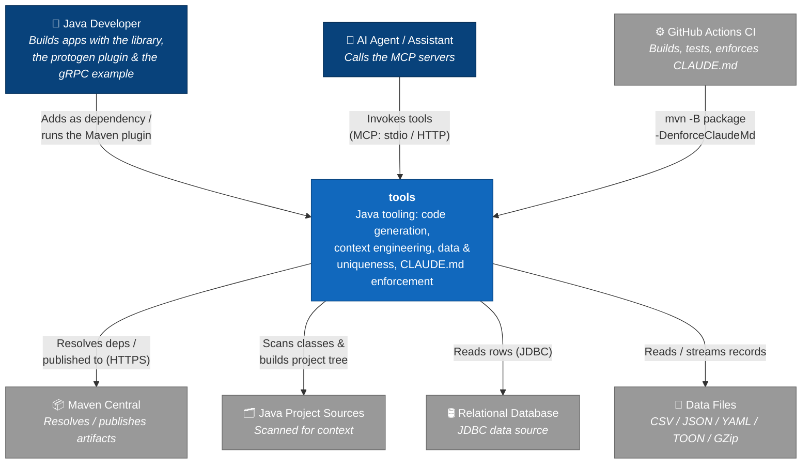
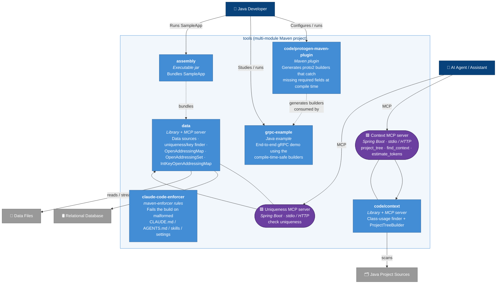
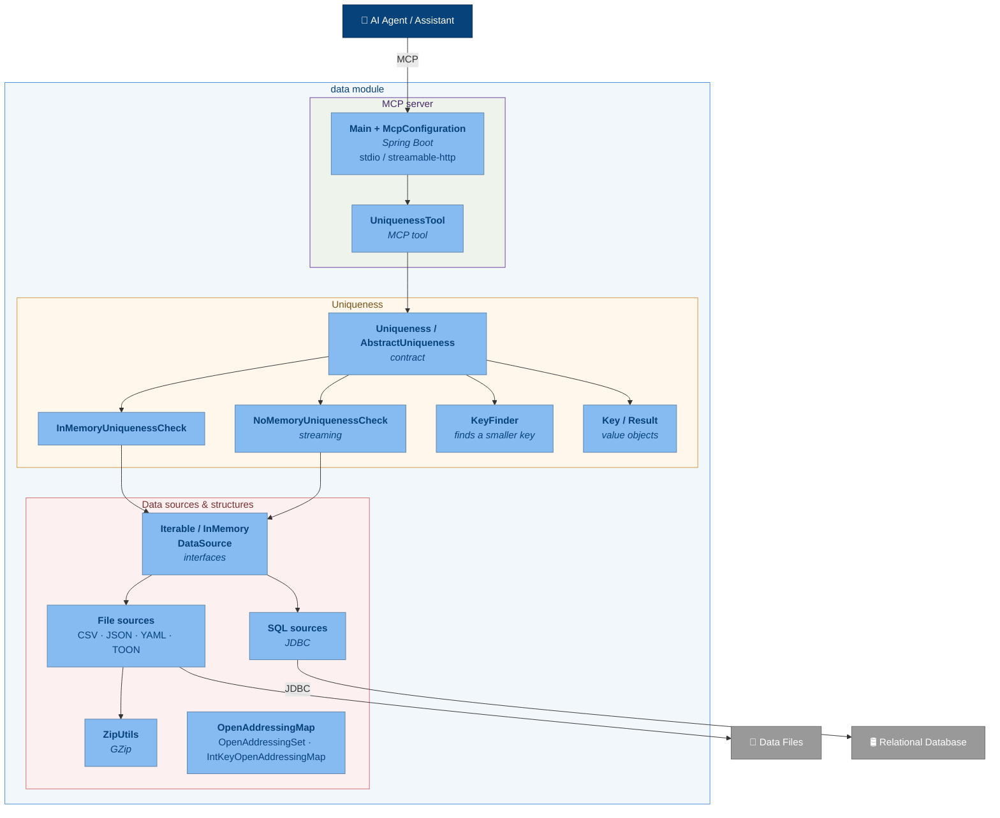
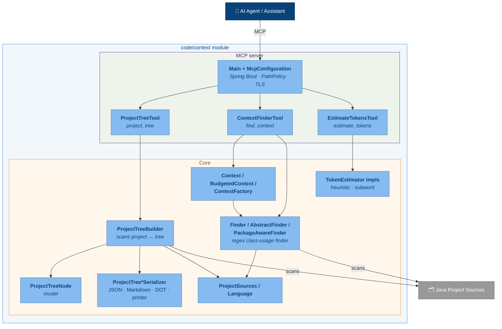

# C4 Architecture — `tools`

This document describes the architecture of the `tools` repository using the
[C4 model](https://c4model.com/) (Context → Container → Component). Diagrams are
written in [Mermaid](https://mermaid.js.org/) flowchart syntax, styled with the
standard C4 colour scheme, and render directly on GitHub.

`tools` is a multi-module Maven library of Java tooling. Its notable
capabilities are compile-time-safe protobuf **code generation**, **context
engineering** for gen-AI agents working with Java code, and a **data** toolkit
(data sources, a uniqueness/key finder, and data structures). Two of the modules
also ship **MCP servers** (Spring Boot apps) so AI assistants can call the tools
directly.

> **Legend** —
> 🟦 dark&nbsp;blue = person ·
> 🔵 blue = the `tools` system ·
> 🔹 light&nbsp;blue = container (Maven module / app) ·
> 🟪 purple = MCP server ·
> ⬜ grey = external system

---

## Level 1 — System Context

How the `tools` system relates to its users and the external systems it depends
on.

---

## Level 2 — Containers (Maven modules)

Each Maven module is a container. The two MCP servers are runnable Spring Boot
applications (purple); the other modules are libraries / plugins.

---

## Level 3 — Components: `data` module

Key components inside the `data` module and how they collaborate.

---

## Level 3 — Components: `code/context` module

Key components inside the context-engineering module.

---

## Notes

- **Base package:** `io.github.adamw7` (`io.github.adamw7.context` for the
  context module, `io.github.adamw7.tools.*` elsewhere).
- **MCP servers:** both are Spring Boot apps whose entry point is `Main.java`
  and support stdio (default) or `--transport.mode=streamable-http`.
- **Build:** Java 25 + Maven 3.9.x; `mvn clean install` from the root. CI runs
  `mvn -B package -DenforceClaudeMd`, which also runs the `claude-code-enforcer`
  rules.
- The `data-test` module is built separately and is intentionally not in the
  root reactor `<modules>` list, so it is omitted from the container view.

See [AGENTS.md](../AGENTS.md) and [README.md](../README.md) for full detail.
