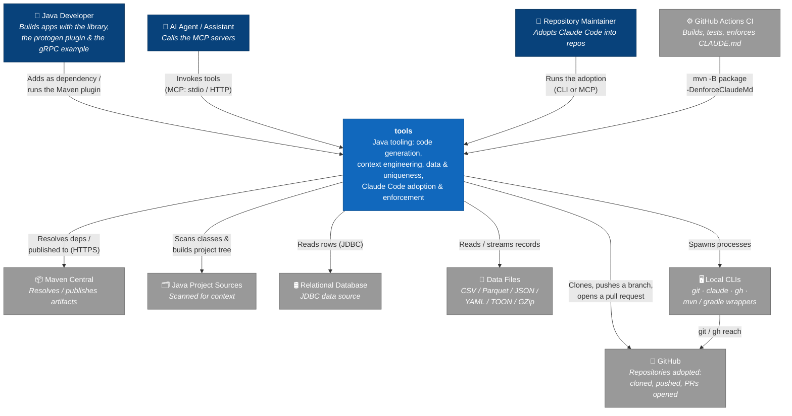
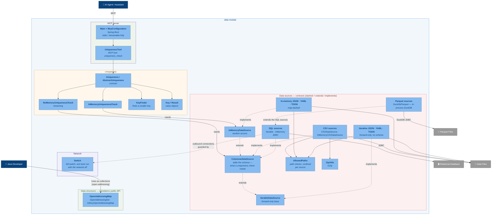
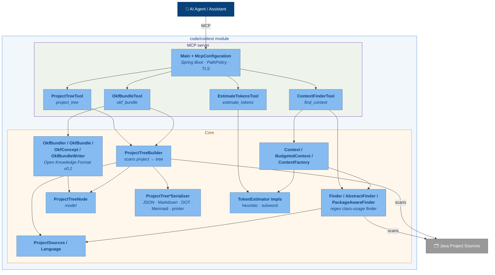
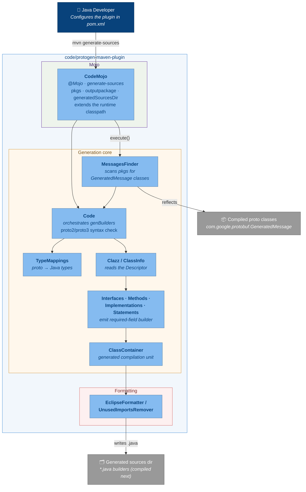
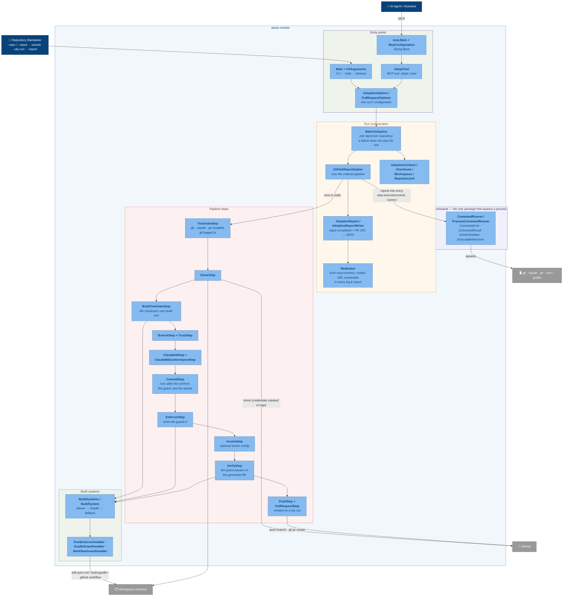
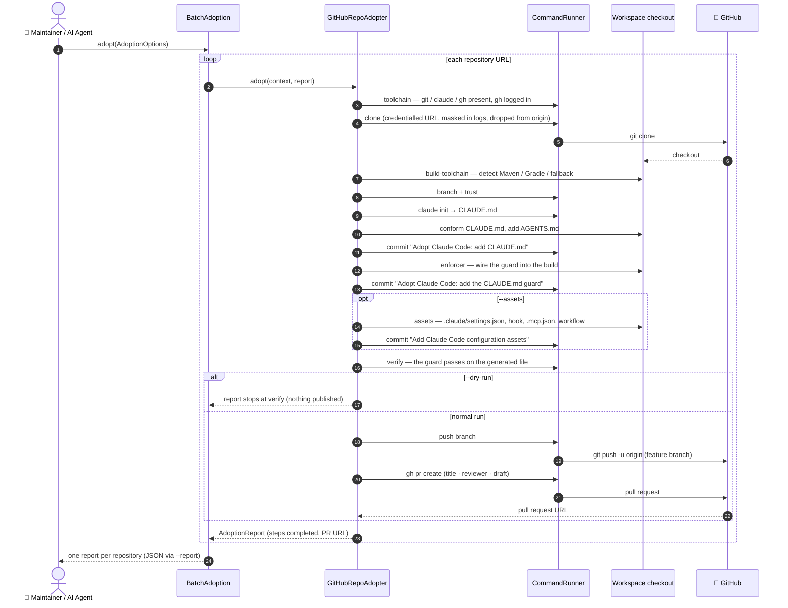
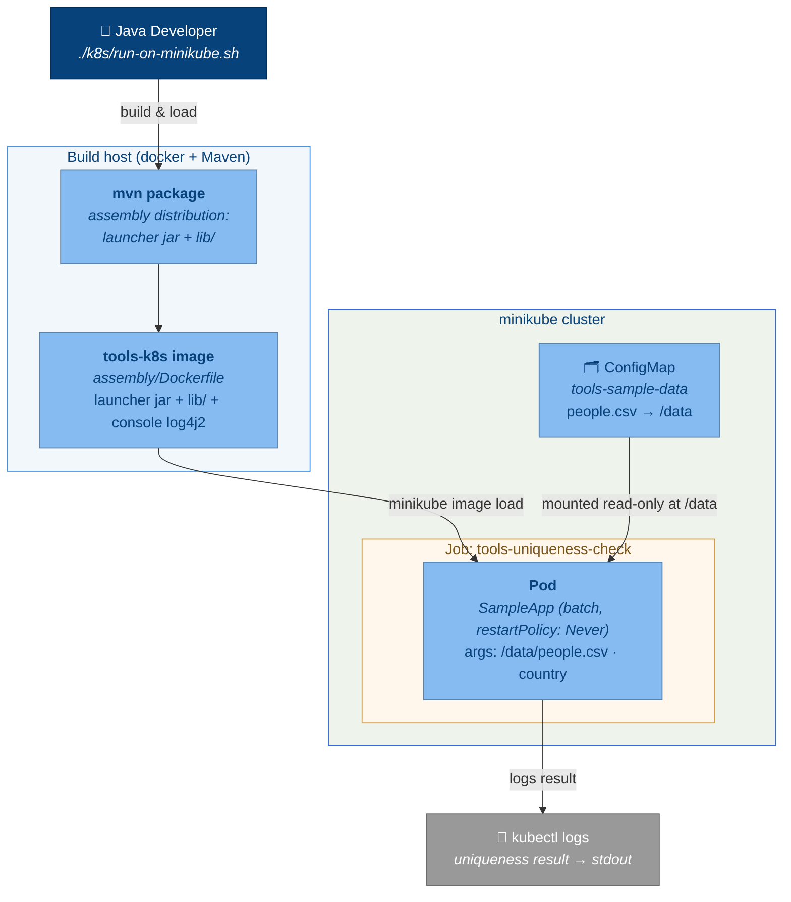

# C4 Architecture — `tools`

This document describes the architecture of the `tools` repository using the
[C4 model](https://c4model.com/) (Context → Container → Component, plus a
dynamic and a deployment view). Diagrams are written in
[Mermaid](https://mermaid.js.org/) flowchart syntax, styled with the standard C4
colour scheme, and render directly on GitHub.

`tools` is a multi-module Maven library of Java tooling. Its notable
capabilities are compile-time-safe protobuf **code generation**, **context
engineering** for gen-AI agents working with Java code, a **data** toolkit (data
sources, a uniqueness/key finder, and data structures), **Claude Code adoption**
of a GitHub repository, and a set of custom **maven-enforcer rules** that keep
agent documentation and configuration honest. Three of the modules ship **MCP
servers** (Spring Boot apps) so AI assistants can call the tools directly.

> **Legend** —
> 🟦 dark&nbsp;blue = person ·
> 🔵 blue = the `tools` system ·
> 🔹 light&nbsp;blue = container (Maven module / app) ·
> 🟪 purple = MCP server ·
> ⬜ grey = external system ·
> solid arrow = runtime call or data flow ·
> dashed arrow = build-time / compile-time dependency

**Contents**

| View | Diagram |
| --- | --- |
| Level 1 | [System Context](#level-1--system-context) |
| Level 2 | [Containers (Maven modules)](#level-2--containers-maven-modules) |
| Level 3 | [`data`](#level-3--components-data-module) · [`code/context`](#level-3--components-codecontext-module) · [`code/protogen-maven-plugin`](#level-3--components-codeprotogen-maven-plugin) · [`adopt`](#level-3--components-adopt-module) · [`claude-code-enforcer`](#level-3--components-claude-code-enforcer-module) |
| Dynamic | [An adoption run](#dynamic-view--an-adoption-run) |
| Deployment | [`k8s/`](#deployment--k8s-uniqueness-check-on-kubernetes) · [CI](#deployment--continuous-integration) |

---

## Level 1 — System Context

How the `tools` system relates to its users and the external systems it depends
on.

```mermaid
flowchart TB
    dev["👤 Java Developer<br/><i>Builds apps with the library,<br/>the protogen plugin &amp; the gRPC example</i>"]
    agent["👤 AI Agent / Assistant<br/><i>Calls the MCP servers</i>"]
    maintainer["👤 Repository Maintainer<br/><i>Adopts Claude Code into repos</i>"]

    subgraph sys [" "]
        tools["<b>tools</b><br/>Java tooling: code generation,<br/>context engineering, data &amp; uniqueness,<br/>Claude Code adoption &amp; enforcement"]
    end

    mavenCentral["📦 Maven Central<br/><i>Resolves / publishes artifacts</i>"]
    projectSrc["🗂️ Java Project Sources<br/><i>Scanned for context</i>"]
    db["🛢️ Relational Database<br/><i>JDBC data source</i>"]
    files["📄 Data Files<br/><i>CSV / Parquet / JSON /<br/>YAML / TOON / GZip</i>"]
    github["🐙 GitHub<br/><i>Repositories adopted:<br/>cloned, pushed, PRs opened</i>"]
    cli["🖥️ Local CLIs<br/><i>git · claude · gh ·<br/>mvn / gradle wrappers</i>"]
    ci["⚙️ GitHub Actions CI<br/><i>Builds, tests, enforces CLAUDE.md</i>"]

    dev -->|"Adds as dependency /<br/>runs the Maven plugin"| tools
    agent -->|"Invokes tools<br/>(MCP: stdio / HTTP)"| tools
    maintainer -->|"Runs the adoption<br/>(CLI or MCP)"| tools
    tools -->|"Resolves deps /<br/>published to (HTTPS)"| mavenCentral
    tools -->|"Scans classes &amp;<br/>builds project tree"| projectSrc
    tools -->|"Reads rows (JDBC)"| db
    tools -->|"Reads / streams records"| files
    tools -->|"Clones, pushes a branch,<br/>opens a pull request"| github
    tools -->|"Spawns processes"| cli
    cli -->|"git / gh reach"| github
    ci -->|"mvn -B package<br/>-DenforceClaudeMd"| tools

    classDef person fill:#08427b,stroke:#052e56,color:#fff
    classDef system fill:#1168bd,stroke:#0b4884,color:#fff
    classDef ext fill:#999999,stroke:#6b6b6b,color:#fff
    class dev,agent,maintainer person
    class tools system
    class mavenCentral,projectSrc,db,files,github,cli,ci ext
    style sys fill:none,stroke:none
```

---

## Level 2 — Containers (Maven modules)

Each Maven module is a container. The three MCP servers are runnable Spring Boot
applications (purple); the other modules are libraries, plugins, or examples.
Solid arrows are runtime calls; dashed arrows are build-time dependencies.

```mermaid
flowchart TB
    dev["👤 Java Developer"]
    agent["👤 AI Agent / Assistant"]
    maintainer["👤 Repository Maintainer"]

    subgraph tools ["tools  (multi-module Maven project)"]
        direction TB

        subgraph shared ["Shared foundations"]
            enforcer["<b>claude-code-enforcer</b><br/><i>maven-enforcer rules</i><br/>Fails the build on malformed<br/>CLAUDE.md / AGENTS.md / README /<br/>skills / settings / .mcp.json"]
            markdownCommon["<b>markdown-common</b><br/><i>Shared library</i><br/>MarkdownDocument · MarkdownText:<br/>lines plus the code and comment masks"]
            testCommon["<b>test-common</b><br/><i>test-jar</i><br/>Shared ArchUnit rule libraries:<br/>coding · naming · test conventions"]
            mcpCommon["<b>mcp-common</b><br/><i>Shared library</i><br/>MCP scaffolding: AbstractMcpConfiguration ·<br/>McpTool · ToolDefinition · TransportConfigurer ·<br/>TransportMode · FailureMessage · Redaction"]
        end

        subgraph codegen ["Code generation"]
            protogen["<b>code/protogen-maven-plugin</b><br/><i>Maven plugin</i><br/>Generates builders that catch missing<br/>required fields at compile time"]
            protogenTest["<b>code/protogen-maven-plugin-test</b><br/><i>Integration tests</i>"]
            grpc["<b>grpc-example</b><br/><i>Java example</i><br/>End-to-end gRPC demo using the<br/>compile-time-safe builders"]
        end

        subgraph dataCol ["Data"]
            data["<b>data</b><br/><i>Library + MCP server</i><br/>Data sources · uniqueness/key finder ·<br/>OpenAddressingMap · OpenAddressingSet ·<br/>IntKeyOpenAddressingMap"]
            dataMcp(["🟪 Uniqueness MCP server<br/><i>Spring Boot · stdio / HTTP</i><br/>uniqueness_check"])
            assembly["<b>assembly</b><br/><i>Executable jar</i><br/>Bundles SampleApp"]
        end

        subgraph agentTooling ["Agent tooling"]
            context["<b>code/context</b><br/><i>Library + MCP server</i><br/>Class-usage finder + ProjectTreeBuilder"]
            contextMcp(["🟪 Context MCP server<br/><i>Spring Boot · stdio / HTTP</i><br/>project_tree · find_context · estimate_tokens · okf_bundle"])
            adopt["<b>adopt</b><br/><i>CLI + MCP server</i><br/>Adoption pipeline: toolchain → clone →<br/>branch → init → conform → guard →<br/>verify → push → PR"]
            adoptMcp(["🟪 Adopt MCP server<br/><i>Spring Boot · stdio / HTTP</i><br/>adopt_repo"])
        end

        context --- contextMcp
        data --- dataMcp
        adopt --- adoptMcp
    end

    projectSrc["🗂️ Java Project Sources"]
    db["🛢️ Relational Database"]
    files["📄 Data Files"]
    github["🐙 GitHub"]
    cli["🖥️ git · claude · gh"]
    ownBuild["⚙️ This repository's build<br/><i>mvn -DenforceClaudeMd ·<br/>every module's tests</i>"]

    dev -->|"Configures / runs"| protogen
    dev -->|"Studies / runs"| grpc
    dev -->|"Runs SampleApp"| assembly
    agent -->|"MCP"| contextMcp
    agent -->|"MCP"| dataMcp
    maintainer -->|"CLI: --repo / --repos"| adopt
    agent -->|"MCP"| adoptMcp

    contextMcp --> context
    dataMcp --> data
    adoptMcp --> adopt

    contextMcp -.->|"builds on"| mcpCommon
    dataMcp -.->|"builds on"| mcpCommon
    adoptMcp -.->|"builds on"| mcpCommon
    protogen -.->|"generates builders<br/>consumed by"| grpc
    protogen -.->|"verified by"| protogenTest
    assembly -.->|"bundles"| data
    ownBuild -.->|"runs the rules on<br/>this repo's docs &amp; config"| enforcer
    ownBuild -.->|"runs the architecture tests"| testCommon

    adopt -->|"wires the rule into<br/>the adopted build"| enforcer
    adopt -->|"reads the generated<br/>CLAUDE.md"| markdownCommon
    enforcer -->|"reads the document<br/>it judges"| markdownCommon
    context -->|"scans"| projectSrc
    data -->|"reads (JDBC / DuckDB)"| db
    data -->|"reads / streams"| files
    adopt -->|"spawns"| cli
    adopt -->|"clone · push · pull request"| github

    classDef person fill:#08427b,stroke:#052e56,color:#fff
    classDef container fill:#438dd5,stroke:#2e6295,color:#fff
    classDef mcp fill:#6b3fa0,stroke:#46296b,color:#fff
    classDef ext fill:#999999,stroke:#6b6b6b,color:#fff
    class dev,agent,maintainer person
    class enforcer,testCommon,mcpCommon,protogen,protogenTest,grpc,assembly,context,data,adopt container
    class contextMcp,dataMcp,adoptMcp mcp
    class projectSrc,db,files,github,cli,ownBuild ext
    style tools fill:#f2f7fc,stroke:#438dd5,color:#08427b
    style shared fill:#eef4ec,stroke:#6b8e6b,color:#2f5230
    style codegen fill:#fff7ec,stroke:#d59a43,color:#7a5418
    style dataCol fill:#fdf0f0,stroke:#d56b6b,color:#7a3030
    style agentTooling fill:#f0f0fb,stroke:#6b3fa0,color:#46296b
```

---

## Level 3 — Components: `data` module

Key components inside the `data` module and how they collaborate. The
uniqueness check needs the schema, so it takes the narrower
`ColumnarDataSource` contract — a forward-only JSON/YAML/TOON source cannot be
handed to it.

```mermaid
flowchart TB
    agent["👤 AI Agent / Assistant"]
    dev["👤 Java Developer"]

    subgraph data ["data module"]
        direction TB

        subgraph mcpLayer ["MCP server"]
            mcpMain["<b>Main + McpConfiguration</b><br/><i>Spring Boot</i><br/>stdio / streamable-http"]
            uniqTool["<b>UniquenessTool</b><br/><i>MCP tool: uniqueness_check</i>"]
        end

        subgraph uniq ["Uniqueness"]
            uniqApi["<b>Uniqueness / AbstractUniqueness</b><br/><i>contract</i>"]
            inMem["<b>InMemoryUniquenessCheck</b>"]
            noMem["<b>NoMemoryUniquenessCheck</b><br/><i>streaming</i>"]
            keyFinder["<b>KeyFinder</b><br/><i>finds a smaller key</i>"]
            result["<b>Key / Result</b><br/><i>value objects</i>"]
        end

        subgraph srcs ["Data sources — contracts (dashed = extends / implements)"]
            iterIfc["<b>IterableDataSource</b><br/><i>forward-only base</i>"]
            columnar["<b>ColumnarDataSource</b><br/><i>adds the schema —<br/>what a uniqueness check needs</i>"]
            inMemIfc["<b>InMemoryDataSource</b><br/><i>random access</i>"]
            csvSrc["<b>CSV sources</b><br/>CSVDataSource ·<br/>InMemoryCSVDataSource"]
            dbSrc["<b>SQL sources</b><br/>Iterable · InMemory<br/><i>JDBC</i>"]
            parquetSrc["<b>Parquet sources</b><br/><i>DuckDbParquet — in-process DuckDB</i>"]
            jacksonMem["<b>In-memory JSON · YAML · TOON</b><br/><i>map-backed</i>"]
            jacksonIter["<b>Iterative JSON · YAML · TOON</b><br/><i>forward-only, no schema</i>"]
            paths["<b>AllowedPaths</b><br/><i>path checks, confined<br/>per source</i>"]
            compression["<b>ZipUtils</b><br/><i>GZip</i>"]
        end

        subgraph struct ["Data structures — standalone public API"]
            structure["<b>OpenAddressingMap</b><br/>OpenAddressingSet · IntKeyOpenAddressingMap"]
        end

        subgraph net ["Network"]
            switch["<b>Switch</b><br/><i>kill-switch; unit tests run<br/>with the network off</i>"]
        end
    end

    db["🛢️ Relational Database"]
    files["📄 Data Files"]
    parquet["📄 Parquet Files"]

    agent -->|"MCP"| mcpMain
    mcpMain --> uniqTool
    uniqTool --> uniqApi
    uniqApi --> inMem
    uniqApi --> noMem
    uniqApi --> keyFinder
    uniqApi --> result
    inMem -->|"needs"| inMemIfc
    noMem -->|"needs"| columnar
    inMemIfc -.->|"extends"| columnar
    columnar -.->|"extends"| iterIfc
    csvSrc -.->|"implements"| columnar
    dbSrc -.->|"implements"| columnar
    parquetSrc -.->|"extends the SQL sources"| dbSrc
    jacksonMem -.->|"implements"| inMemIfc
    jacksonIter -.->|"implements"| iterIfc
    csvSrc --> compression
    csvSrc --> paths
    jacksonMem --> paths
    jacksonIter --> paths
    csvSrc --> files
    jacksonMem --> files
    jacksonIter --> files
    parquetSrc -->|"DuckDB JDBC"| parquet
    dbSrc -->|"JDBC"| db
    dbSrc -.->|"outbound connections<br/>guarded by"| switch
    dev -->|"Uses as collections<br/>(open-addressing)"| structure

    classDef person fill:#08427b,stroke:#052e56,color:#fff
    classDef comp fill:#85bbf0,stroke:#5d82a8,color:#08427b
    classDef ext fill:#999999,stroke:#6b6b6b,color:#fff
    class agent,dev person
    class mcpMain,uniqTool,uniqApi,inMem,noMem,keyFinder,result,iterIfc,columnar,inMemIfc,csvSrc,dbSrc,parquetSrc,jacksonMem,jacksonIter,paths,compression,structure,switch comp
    class db,files,parquet ext
    style data fill:#f2f7fc,stroke:#438dd5,color:#08427b
    style mcpLayer fill:#eef4ec,stroke:#6b3fa0,color:#46296b
    style uniq fill:#fff7ec,stroke:#d59a43,color:#7a5418
    style srcs fill:#fdf0f0,stroke:#d56b6b,color:#7a3030
    style struct fill:#eef4ec,stroke:#6b8e6b,color:#2f5230
    style net fill:#f0f0fb,stroke:#6b3fa0,color:#46296b
```

---

## Level 3 — Components: `code/context` module

Key components inside the context-engineering module.

```mermaid
flowchart TB
    agent["👤 AI Agent / Assistant"]

    subgraph context ["code/context module"]
        direction TB

        subgraph mcpLayer ["MCP server"]
            mcpMain["<b>Main + McpConfiguration</b><br/><i>Spring Boot · PathPolicy · TLS</i>"]
            treeTool["<b>ProjectTreeTool</b><br/><i>project_tree</i>"]
            finderTool["<b>ContextFinderTool</b><br/><i>find_context</i>"]
            tokenTool["<b>EstimateTokensTool</b><br/><i>estimate_tokens</i>"]
            okfTool["<b>OkfBundleTool</b><br/><i>okf_bundle</i>"]
        end

        subgraph core ["Core"]
            finder["<b>Finder / AbstractFinder /<br/>PackageAwareFinder</b><br/><i>regex class-usage finder</i>"]
            context_["<b>Context / BudgetedContext /<br/>ContextFactory</b>"]
            treeBuilder["<b>ProjectTreeBuilder</b><br/><i>scans project → tree</i>"]
            treeNode["<b>ProjectTreeNode</b><br/><i>model</i>"]
            serializers["<b>ProjectTree*Serializer</b><br/>JSON · Markdown · DOT ·<br/>Mermaid · printer"]
            okf["<b>OkfBundler / OkfBundle /<br/>OkfConcept / OkfBundleWriter</b><br/><i>Open Knowledge Format v0.2</i>"]
            tokens["<b>TokenEstimator impls</b><br/>heuristic · subword"]
            sources["<b>ProjectSources / Language</b>"]
        end
    end

    projectSrc["🗂️ Java Project Sources"]

    agent -->|"MCP"| mcpMain
    mcpMain --> treeTool
    mcpMain --> finderTool
    mcpMain --> tokenTool
    mcpMain --> okfTool

    treeTool --> treeBuilder
    okfTool --> treeBuilder
    okfTool --> okf
    okf --> treeNode
    finderTool --> context_
    finderTool --> finder
    tokenTool --> tokens

    treeBuilder --> treeNode
    treeBuilder --> serializers
    treeBuilder --> sources
    finder --> sources
    context_ --> finder
    context_ --> tokens

    finder -->|"scans"| projectSrc
    treeBuilder -->|"scans"| projectSrc

    classDef person fill:#08427b,stroke:#052e56,color:#fff
    classDef comp fill:#85bbf0,stroke:#5d82a8,color:#08427b
    classDef ext fill:#999999,stroke:#6b6b6b,color:#fff
    class agent person
    class mcpMain,treeTool,finderTool,tokenTool,okfTool,finder,context_,treeBuilder,treeNode,serializers,okf,tokens,sources comp
    class projectSrc ext
    style context fill:#f2f7fc,stroke:#438dd5,color:#08427b
    style mcpLayer fill:#eef4ec,stroke:#6b3fa0,color:#46296b
    style core fill:#fff7ec,stroke:#d59a43,color:#7a5418
```

---

## Level 3 — Components: `code/protogen-maven-plugin`

How the code-generation pipeline turns compiled proto message classes into
compile-time-safe builders, run in the `generate-sources` phase.

```mermaid
flowchart TB
    dev["👤 Java Developer<br/><i>Configures the plugin in pom.xml</i>"]

    subgraph protogen ["code/protogen-maven-plugin"]
        direction TB

        subgraph entry ["Mojo"]
            mojo["<b>CodeMojo</b><br/><i>@Mojo · generate-sources</i><br/>pkgs · outputpackage · generatedSourcesDir<br/>extends the runtime classpath"]
        end

        subgraph gen ["Generation core"]
            finder["<b>MessagesFinder</b><br/><i>scans pkgs for<br/>GeneratedMessage classes</i>"]
            code["<b>Code</b><br/><i>orchestrates genBuilders</i><br/>proto2/proto3 syntax check"]
            typeMap["<b>TypeMappings</b><br/><i>proto → Java types</i>"]
            clazz["<b>Clazz / ClassInfo</b><br/><i>reads the Descriptor</i>"]
            emit["<b>Interfaces · Methods ·<br/>Implementations · Statements</b><br/><i>emit required-field builder</i>"]
            container["<b>ClassContainer</b><br/><i>generated compilation unit</i>"]
        end

        subgraph fmt ["Formatting"]
            formatter["<b>EclipseFormatter /<br/>UnusedImportsRemover</b>"]
        end
    end

    protoClasses["📦 Compiled proto classes<br/><i>com.google.protobuf.GeneratedMessage</i>"]
    genSources["🗂️ Generated sources dir<br/><i>*.java builders (compiled next)</i>"]

    dev -->|"mvn generate-sources"| mojo
    mojo -->|"execute()"| finder
    finder -->|"reflects"| protoClasses
    mojo --> code
    finder --> code
    code --> typeMap
    code --> clazz
    clazz --> emit
    emit --> container
    container --> formatter
    formatter -->|"writes .java"| genSources

    classDef person fill:#08427b,stroke:#052e56,color:#fff
    classDef comp fill:#85bbf0,stroke:#5d82a8,color:#08427b
    classDef ext fill:#999999,stroke:#6b6b6b,color:#fff
    class dev person
    class mojo,finder,code,typeMap,clazz,emit,container,formatter comp
    class protoClasses,genSources ext
    style protogen fill:#f2f7fc,stroke:#438dd5,color:#08427b
    style entry fill:#eef4ec,stroke:#6b3fa0,color:#46296b
    style gen fill:#fff7ec,stroke:#d59a43,color:#7a5418
    style fmt fill:#fdf0f0,stroke:#d56b6b,color:#7a3030
```

---

## Level 3 — Components: `adopt` module

How a run adopts Claude Code into one or more GitHub repositories. Every step
implements `AdoptionStep`, so the pipeline is a list the entry points assemble
from `AdoptionOptions`; only the `command` package spawns processes, and only
`CloneStep` reads the credentialled clone URL (both pinned by ArchUnit).

```mermaid
flowchart TB
    maintainer["👤 Repository Maintainer<br/><i>--repo / --repos · --assets ·<br/>--dry-run · --report</i>"]
    agent["👤 AI Agent / Assistant"]

    subgraph adopt ["adopt module"]
        direction TB

        subgraph entryLayer ["Entry points"]
            cliMain["<b>Main + CliArguments</b><br/><i>CLI · --help · --timeout</i>"]
            mcpMain["<b>mcp.Main + McpConfiguration</b><br/><i>Spring Boot</i>"]
            adoptTool["<b>AdoptTool</b><br/><i>MCP tool: adopt_repo</i>"]
            options["<b>AdoptionOptions /<br/>PullRequestOptions</b><br/><i>one run's configuration</i>"]
        end

        subgraph runLayer ["Run orchestration"]
            batch["<b>BatchAdoption</b><br/><i>one report per repository;<br/>a failure does not stop the rest</i>"]
            adopter["<b>GitHubRepoAdopter</b><br/><i>runs the ordered pipeline</i>"]
            ctx["<b>AdoptionContext / Checkouts /<br/>Workspaces / RepositoryUrl</b>"]
            report["<b>AdoptionReport /<br/>AdoptionReportWriter</b><br/><i>steps completed + PR URL → JSON</i>"]
            redaction["<b>Redaction</b><br/><i>from mcp-common: masks URL credentials<br/>in every log &amp; report</i>"]
        end

        subgraph steps ["Pipeline steps"]
            toolchain["<b>ToolchainStep</b><br/><i>git · claude · gh installed,<br/>gh logged in</i>"]
            clone["<b>CloneStep</b>"]
            buildToolchain["<b>BuildToolchainStep</b><br/><i>the checkout's own build tool</i>"]
            branch["<b>BranchStep + TrustStep</b>"]
            init["<b>ClaudeInitStep +<br/>ClaudeMdConformanceStep</b>"]
            commit["<b>CommitStep</b><br/><i>runs after the conform,<br/>the guard, and the assets</i>"]
            enforcerStep["<b>EnforcerStep</b><br/><i>wires the guard in</i>"]
            assets["<b>AssetsStep</b><br/><i>optional starter config</i>"]
            verify["<b>VerifyStep</b><br/><i>the guard passes on<br/>the generated file</i>"]
            publish["<b>PushStep +<br/>PullRequestStep</b><br/><i>omitted on a dry run</i>"]
        end

        subgraph buildSystems ["Build systems"]
            bs["<b>BuildSystems / BuildSystem</b><br/><i>Maven → Gradle → fallback</i>"]
            installers["<b>PomEnforcerInstaller ·<br/>GradleGuardInstaller ·<br/>WorkflowGuardInstaller</b>"]
        end

        subgraph cmd ["command — the only package that spawns a process"]
            runner["<b>CommandRunner /<br/>ProcessCommandRunner</b><br/><i>CommandLine · CommandResult ·<br/>StreamGobbler · ExecutableResolver</i>"]
        end
    end

    github["🐙 GitHub"]
    cli["🖥️ git · claude · gh · mvn / gradle"]
    workspace["🗂️ Workspace checkout"]

    maintainer --> cliMain
    agent -->|"MCP"| mcpMain
    mcpMain --> adoptTool
    cliMain --> options
    adoptTool --> options
    options --> batch
    batch --> adopter
    batch --> ctx
    adopter --> report
    report --> redaction

    adopter -->|"runs in order"| toolchain
    toolchain --> clone
    clone --> buildToolchain
    buildToolchain --> branch
    branch --> init
    init --> commit
    commit --> enforcerStep
    enforcerStep --> assets
    assets --> verify
    verify --> publish

    buildToolchain --> bs
    enforcerStep --> bs
    verify --> bs
    bs --> installers
    installers -->|"edit pom.xml / build.gradle /<br/>.github workflow"| workspace

    adopter -->|"injects into every<br/>step.execute(context, runner)"| runner
    runner -->|"spawns"| cli
    clone -->|"clone (credentials masked in logs)"| github
    publish -->|"push branch · gh pr create"| github
    clone --> workspace

    classDef person fill:#08427b,stroke:#052e56,color:#fff
    classDef comp fill:#85bbf0,stroke:#5d82a8,color:#08427b
    classDef ext fill:#999999,stroke:#6b6b6b,color:#fff
    class maintainer,agent person
    class cliMain,mcpMain,adoptTool,options,batch,adopter,ctx,report,redaction,toolchain,clone,buildToolchain,branch,init,enforcerStep,assets,verify,publish,commit,bs,installers,runner comp
    class github,cli,workspace ext
    style adopt fill:#f2f7fc,stroke:#438dd5,color:#08427b
    style entryLayer fill:#eef4ec,stroke:#6b3fa0,color:#46296b
    style runLayer fill:#fff7ec,stroke:#d59a43,color:#7a5418
    style steps fill:#fdf0f0,stroke:#d56b6b,color:#7a3030
    style buildSystems fill:#eef4ec,stroke:#6b8e6b,color:#2f5230
    style cmd fill:#f0f0fb,stroke:#6b3fa0,color:#46296b
```

---

## Level 3 — Components: `claude-code-enforcer` module

The custom `maven-enforcer-plugin` rules that fail a build when the agent
documentation or configuration is missing, malformed, or inconsistent. Rules
extend shared bases (`MarkdownFormatRule`, `JsonFileRule`,
`MultiDefinitionRule`) so a new rule states only what it checks. The check is
opt-in via `-DenforceClaudeMd` and needs the rule jar installed first.

```mermaid
flowchart TB
    build["⚙️ Maven build<br/><i>maven-enforcer-plugin ·<br/>-DenforceClaudeMd</i>"]

    subgraph enforcer ["claude-code-enforcer module"]
        direction TB

        subgraph base ["rule — shared bases"]
            entry["<b>ClaudeCodeEnforcerRule</b><br/><i>the base every rule extends:<br/>severity · reportFile · baselineFile</i>"]
            bases["<b>MarkdownFormatRule ·<br/>JsonFileRule · ScanTargets ·<br/>JsonNodes · Baseline · HtmlReport</b>"]
        end

        subgraph docRules ["doc — documentation contract"]
            docs["<b>ClaudeMdFormatRule · AgentsMdFormatRule ·<br/>ReadmeConsistencyRule · CrossDocConsistencyRule ·<br/>ModuleMapConsistencyRule · ContextBudgetRule ·<br/>MemoryImportsRule</b>"]
        end

        subgraph defRules ["definition — skills, agents, plugins"]
            defs["<b>SkillFilesExistRule · UniqueNamesRule ·<br/>UniqueDescriptionsRule · SubAgentFormatRule ·<br/>CommandFormatRule · PluginFormatRule</b>"]
        end

        subgraph setRules ["settings &amp; mcp"]
            sets["<b>SettingsJsonValidRule · PermissionsFormatRule ·<br/>HooksFormatRule · HookCommandsValidRule ·<br/>LocalSettingsIgnoredRule · McpServersValidRule ·<br/>McpConfigFormatRule</b>"]
        end

        subgraph secRules ["secret"]
            secrets["<b>NoSecretsRule / CredentialPattern</b>"]
        end

        subgraph okfRules ["okf — Open Knowledge Format bundles"]
            okf["<b>OkfBundleFormatRule</b>"]
        end

        subgraph textSupport ["text — parsing support"]
            text["<b>FrontMatter · FrontMatterFixer ·<br/>NameConvention</b>"]
        end
    end

    markdown["<b>markdown-common</b><br/><i>Shared library</i><br/>MarkdownDocument · MarkdownText<br/>also read by adopt's ClaudeMdConformer"]
    text --> markdown

    docsFiles["📄 CLAUDE.md · AGENTS.md · README.md"]
    config["🗂️ .claude/ · .mcp.json ·<br/>.claude-plugin/plugin.json"]
    pom["📦 Root pom.xml<br/><i>&lt;module&gt; list</i>"]
    bundle["🗂️ OKF bundle<br/><i>bundleDir</i>"]

    build -->|"runs the configured rules"| docs
    build --> defs
    build --> sets
    build --> secrets
    build --> okf
    docs -.->|"extends"| entry
    defs -.->|"extends"| entry
    sets -.->|"extends"| entry
    secrets -.->|"extends"| entry
    okf -.->|"extends"| entry
    entry --> bases
    docs --> text
    defs --> text
    okf --> text
    docs --> docsFiles
    docs --> pom
    defs --> config
    sets --> config
    secrets --> config
    secrets --> docsFiles
    okf --> bundle

    classDef comp fill:#85bbf0,stroke:#5d82a8,color:#08427b
    classDef ext fill:#999999,stroke:#6b6b6b,color:#fff
    class entry,bases,docs,defs,sets,secrets,okf,text comp
    class build,docsFiles,config,pom,bundle ext
    style enforcer fill:#f2f7fc,stroke:#438dd5,color:#08427b
    style base fill:#eef4ec,stroke:#6b3fa0,color:#46296b
    style docRules fill:#fff7ec,stroke:#d59a43,color:#7a5418
    style defRules fill:#fdf0f0,stroke:#d56b6b,color:#7a3030
    style setRules fill:#eef4ec,stroke:#6b8e6b,color:#2f5230
    style secRules fill:#f0f0fb,stroke:#6b3fa0,color:#46296b
    style okfRules fill:#fdf0f0,stroke:#d56b6b,color:#7a3030
    style textSupport fill:#f5f5f5,stroke:#999999,color:#333333
```

---

## Dynamic view — an adoption run

The order of a single repository's adoption, and where a run stops when
`--dry-run` is given. The two toolchain checks are deliberately early: the
pipeline's own tools before any expensive work, the checkout's build tool as
soon as the clone reveals which one it is.

```mermaid
sequenceDiagram
    autonumber
    actor M as 👤 Maintainer / AI Agent
    participant B as BatchAdoption
    participant A as GitHubRepoAdopter
    participant R as CommandRunner
    participant W as Workspace checkout
    participant G as 🐙 GitHub

    M->>B: adopt(AdoptionOptions)
    loop each repository URL
        B->>A: adopt(context, report)
        A->>R: toolchain — git / claude / gh present, gh logged in
        A->>R: clone (credentialled URL, masked in logs, dropped from origin)
        R->>G: git clone
        G-->>W: checkout
        A->>W: build-toolchain — detect Maven / Gradle / fallback
        A->>R: branch + trust
        A->>R: claude init → CLAUDE.md
        A->>W: conform CLAUDE.md, add AGENTS.md
        A->>R: commit "Adopt Claude Code: add CLAUDE.md"
        A->>W: enforcer — wire the guard into the build
        A->>R: commit "Adopt Claude Code: add the CLAUDE.md guard"
        opt --assets
            A->>W: assets — .claude/settings.json, hook, .mcp.json, workflow
            A->>R: commit "Add Claude Code configuration assets"
        end
        A->>R: verify — the guard passes on the generated file
        alt --dry-run
            A-->>B: report stops at verify (nothing published)
        else normal run
            A->>R: push branch
            R->>G: git push -u origin (feature branch)
            A->>R: gh pr create (title · reviewer · draft)
            R->>G: pull request
            G-->>A: pull request URL
        end
        A-->>B: AdoptionReport (steps completed, PR URL)
    end
    B-->>M: one report per repository (JSON via --report)
```

A step that throws marks the report failed and propagates, so the caller keeps
the report of the steps that did complete; the next repository in the batch is
still adopted into its own checkout.

---

## Deployment — `k8s/` (uniqueness check on Kubernetes)

An optional C4 deployment view of the assets under `k8s/`, which run `SampleApp`
(the CSV column-uniqueness checker) as a run-to-completion **Job** on a local
minikube cluster.

```mermaid
flowchart TB
    dev["👤 Java Developer<br/><i>./k8s/run-on-minikube.sh</i>"]

    subgraph build ["Build host (docker + Maven)"]
        maven["<b>mvn package</b><br/><i>assembly distribution:<br/>launcher jar + lib/</i>"]
        image["<b>tools-k8s image</b><br/><i>assembly/Dockerfile</i><br/>launcher jar + lib/ + console log4j2"]
    end

    subgraph cluster ["minikube cluster"]
        direction TB
        subgraph job ["Job: tools-uniqueness-check"]
            pod["<b>Pod</b><br/><i>SampleApp (batch, restartPolicy: Never)</i><br/>args: /data/people.csv · country"]
        end
        cm["🗂️ ConfigMap<br/><i>tools-sample-data</i><br/>people.csv → /data"]
    end

    logs["📄 kubectl logs<br/><i>uniqueness result → stdout</i>"]

    dev -->|"build &amp; load"| maven
    maven --> image
    image -->|"minikube image load"| pod
    cm -->|"mounted read-only at /data"| pod
    pod -->|"logs result"| logs

    classDef person fill:#08427b,stroke:#052e56,color:#fff
    classDef comp fill:#85bbf0,stroke:#5d82a8,color:#08427b
    classDef ext fill:#999999,stroke:#6b6b6b,color:#fff
    class dev person
    class maven,image,pod,cm comp
    class logs ext
    style build fill:#f2f7fc,stroke:#438dd5,color:#08427b
    style cluster fill:#eef4ec,stroke:#326ce5,color:#08427b
    style job fill:#fff7ec,stroke:#d59a43,color:#7a5418
```

---

## Deployment — continuous integration

Which workflow runs what, and what leaves the build. `maven.yml` is the gate on
every pull request to `main` — and the only workflow that runs the CLAUDE.md
checks; the heavier and slower checks are scheduled, and everything that
publishes fires on a GitHub release. `docker.yml` sits in both halves: it builds,
smoke-runs and scans the image on its weekly run, and does the same again on a
release before pushing the multi-arch image to GHCR. Triggers below are the ones
in `.github/workflows/`; every workflow builds on JDK 25 (Temurin).

```mermaid
flowchart TB
    pr["🔀 push / pull request → main"]
    sched["⏰ Schedule"]
    manual["🖱️ workflow_dispatch"]
    rel["🏷️ GitHub release"]

    subgraph gate ["Pull-request gate"]
        mavenWf["<b>maven.yml</b><br/><i>installs the enforcer rule, then<br/>mvn -B package -DenforceClaudeMd</i><br/>the only workflow running the doc checks;<br/>build step capped at 120 s"]
    end

    subgraph scheduled ["Scheduled"]
        itWf["<b>integration-tests.yml</b><br/><i>daily · -P integration-tests verify</i>"]
        codeqlWf["<b>codeql.yml</b><br/><i>Saturdays · CodeQL analysis</i>"]
        covWf["<b>coverage.yml</b><br/><i>Saturdays · JaCoCo, 80% floor</i>"]
        pitWf["<b>pitest.yml</b><br/><i>Sundays · mutation testing</i>"]
        winWf["<b>maven-windows.yml</b><br/><i>Sundays · the build on Windows</i>"]
        dockerWf["<b>docker.yml</b><br/><i>Saturdays · builds, smoke-runs<br/>and scans the image; on a release,<br/>also pushes it to GHCR</i>"]
    end

    subgraph publish ["On a release"]
        ghPkg["<b>maven-publish.yml</b><br/><i>GitHub Packages</i>"]
        central["<b>central-publish.yml</b><br/><i>Maven Central; dispatch =<br/>staged-only dry run</i>"]
    end

    pr --> mavenWf
    sched --> itWf
    sched --> codeqlWf
    sched --> covWf
    sched --> pitWf
    sched --> winWf
    sched --> dockerWf
    manual --> pitWf
    manual --> winWf
    manual --> dockerWf
    manual --> central
    rel --> dockerWf
    rel --> ghPkg
    rel --> central

    classDef comp fill:#85bbf0,stroke:#5d82a8,color:#08427b
    classDef ext fill:#999999,stroke:#6b6b6b,color:#fff
    class mavenWf,dockerWf,codeqlWf,itWf,covWf,pitWf,winWf,ghPkg,central comp
    class pr,sched,manual,rel ext
    style gate fill:#eef4ec,stroke:#6b8e6b,color:#2f5230
    style scheduled fill:#fff7ec,stroke:#d59a43,color:#7a5418
    style publish fill:#f2f7fc,stroke:#438dd5,color:#08427b
```

---

## Notes

- **Base package:** `io.github.adamw7` (`io.github.adamw7.context` for the
  context module, `io.github.adamw7.tools.*` elsewhere).
- **MCP servers:** all three (`data` uniqueness, `code/context`, `adopt`) are
  Spring Boot apps whose entry point is `Main.java` and which support stdio
  (default), streamable HTTP, or stateless HTTP. All three build on the shared
  **`mcp-common`** module (`AbstractMcpConfiguration`, `McpTool`,
  `ToolDefinition`, `ToolArguments`, `ToolResult`, `TransportConfigurer`,
  `TransportMode`), and each ships an `MCP_USAGE.md` next to its `mcp` package.
  A mode `TransportMode` does not know is refused before Spring starts, and
  every tool's failure is masked on both channels by `FailureMessage` —
  credentials out of the logged arguments through `Redaction`, credentials and
  filesystem locations out of the message the client reads.
- **Build:** Java 25 + Maven 3.9.x; `mvn clean install` from the root. CI runs
  `mvn -B package -DenforceClaudeMd`, which also runs the `claude-code-enforcer`
  rules — those need a two-phase build, since a maven-enforcer rule must be
  resolvable as a jar before the build that uses it runs.
- **Architecture rules:** the layering these diagrams show is executable.
  ArchUnit tests in each module's `.architecture` test package fail the build
  when it is broken — data-source contracts must not depend on their
  implementations, the uniqueness core must not depend on its MCP adapter, JDBC
  stays confined to `source.db`, and the adoption spawns processes only in its
  `command` package. The rules common to every module live once in
  **`test-common`** and are pulled in with `ArchTests.in(...)`.
- The `data-test` module is built separately and is intentionally not in the
  root reactor `<modules>` list, so it is omitted from the container view;
  `code` is an aggregator pom whose children (`protogen-maven-plugin`,
  `protogen-maven-plugin-test`, `context`) appear instead.
- **Deployment:** `k8s/` packages `SampleApp` into the `tools-k8s` image
  (`assembly/Dockerfile`) and runs it as a Kubernetes **Job**
  (`job-uniqueness-check.yaml`) reading a CSV from a ConfigMap — see the
  Deployment diagram above and `k8s/README.md`.
- **Keeping this current:** a new `<module>` in the root pom belongs in the
  container view; a new MCP tool belongs in the relevant component view. The
  standing decisions behind these structures (DuckDB, log4j2, MCP on Spring
  Boot, documentation as an enforced contract, the security posture) are
  recorded in [docs/adr](adr).

See [AGENTS.md](../AGENTS.md) and [README.md](../README.md) for full detail.
