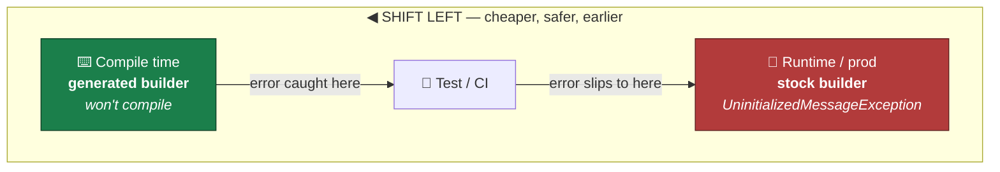
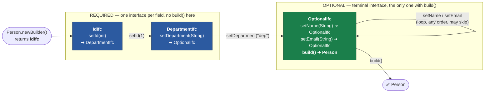
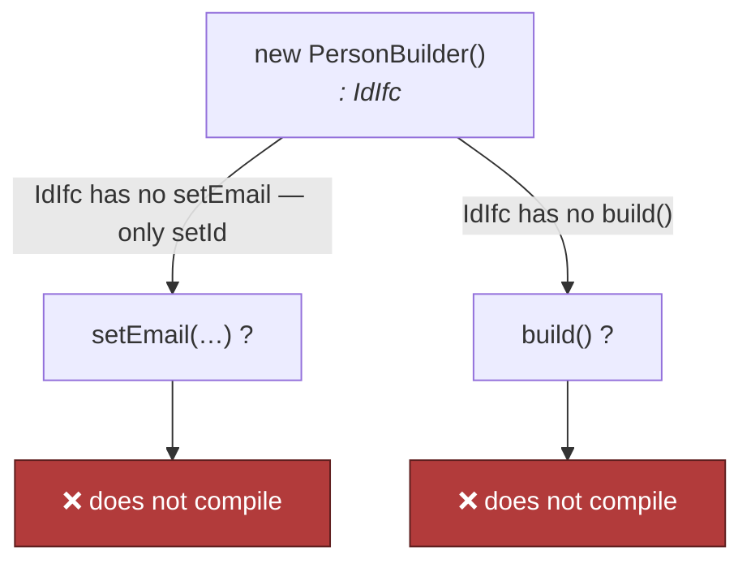
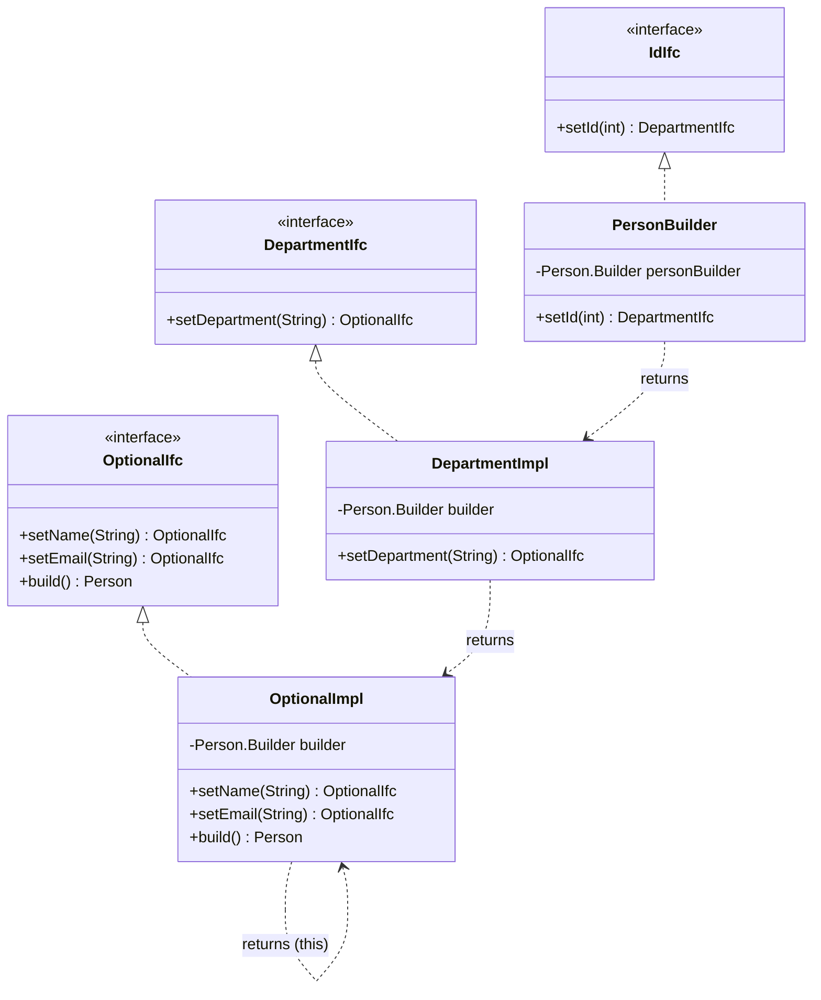

# Compile-time-safe protobuf builders — shifting field validation *left*

The `protogen-maven-plugin` turns a runtime failure into a **compile-time**
failure: with the generated builder, code that forgets a `required` field simply
**does not compile**. This document visualises *how* that guarantee is produced —
a chain of single-method interfaces where each `required` field hands you the
*next* interface, and only the **last** interface (the one carrying the optional
fields) exposes `build()`.

> **Diagrams** are written in [Mermaid](https://mermaid.js.org/) and render
> directly on GitHub. See also [c4-architecture.md](c4-architecture.md) for the
> repository's overall architecture.

---

## The problem — validation happens at *runtime*

Stock protobuf builders let you call `build()` at any time. A missing `required`
field is only discovered when the program *runs*:

```java
Person.Builder personBuilder = Person.newBuilder();
personBuilder.setEmail("email@sth.com");
personBuilder.setName("Adam");

// compiles fine — blows up at runtime:
person = personBuilder.build();
// → UninitializedMessageException: Message missing required fields: id, department
```

Using the example message throughout this document:

```proto
syntax = "proto2";

message Person {
  optional string name       = 1;   // optional
  required int32  id         = 2;   // required
  optional string email      = 3;   // optional
  required string department = 4;   // required
}
```

---

## Shifting the error *left*

"Shift left" means moving a defect's discovery earlier in the lifecycle — the
further left on this timeline, the cheaper and safer the fix. The generated
builder moves *"required field missing"* from **runtime** all the way to
**compile time**.



---

## How the guarantee is built — a chain of interfaces

The plugin (`ClassInfo`) splits a message's fields into two groups:

| group | fields (for `Person`) | role in the chain |
|-------|-----------------------|-------------------|
| **non-optional** — `required` ∪ `map` ∪ `repeated` | `id`, `department` | one interface **each**, threaded in order |
| **optional** — everything else | `name`, `email` | folded into a **single** terminal interface |

`Interfaces.generateRequired()` emits **one interface per non-optional field**,
and `Utils.getNextIfc(...)` wires each field's setter to *return the interface
for the next field*. The last non-optional field returns `…OptionalIfc`, and
**only `…OptionalIfc` declares `build()`**. There is no way to name a type that
both skips a `required` setter and still offers `build()` — the method does not
exist on the earlier interfaces.



The **type of the value in your hand** advances one step with every required
setter. You literally cannot hold an `OptionalIfc` (the only thing that can
`build()`) until you have called *both* `setId` and `setDepartment`.

```java
// each call returns a DIFFERENT type — the type is the proof of progress:
IdIfc         step0 = new PersonBuilder();            // start
DepartmentIfc step1 = step0.setId(1);                 // id done
OptionalIfc   step2 = step1.setDepartment("dep");     // department done → build() unlocked
Person        p     = step2.setName("Adam").build();  // optionals, then build

// fluent, the normal way to write it:
Person person = new PersonBuilder()
        .setId(1)
        .setDepartment("dep")
        .setEmail("sth@sth.net")   // optional — may be omitted
        .build();
```

### Why the incomplete call cannot compile



Because `build()` is declared **only** on the terminal `OptionalIfc`, and the
only way to *obtain* an `OptionalIfc` is to pass through every required setter,
"forgot a required field" is expressed as "that type doesn't have the method you
called." The compiler rejects it.

---

## The generated types, side by side

Each interface has a matching implementation. A required setter constructs and
returns the **next** implementation; the terminal `OptionalImpl` returns `this`
for its optional setters and finally delegates to the real protobuf builder in
`build()`.



> **Note** — the *non-optional* group is `required` ∪ `map` ∪ `repeated`
> (`ClassInfo.nonOptional()`), so `map` and `repeated` fields also become steps
> in the chain. The full generator additionally emits `hasXxx()`, `clearXxx()`
> and, for `oneof` groups, `getXxxCase()` accessors; they are elided here to keep
> the shift-left mechanism in focus. proto3 has no `required` fields, so its
> chain is a single terminal interface — nothing to enforce.

---

## Summary

- Non-optional fields → **one interface each**, chained; optional fields → **one
  terminal interface** carrying `build()`.
- Every required setter **returns the next interface's type**, so the value's
  *type* records how far you have progressed.
- `build()` exists **only** on the terminal interface, unreachable until every
  required field is set.
- Result: *"missing required field"* is caught by the **compiler**, not at
  runtime — the error has shifted all the way left.
